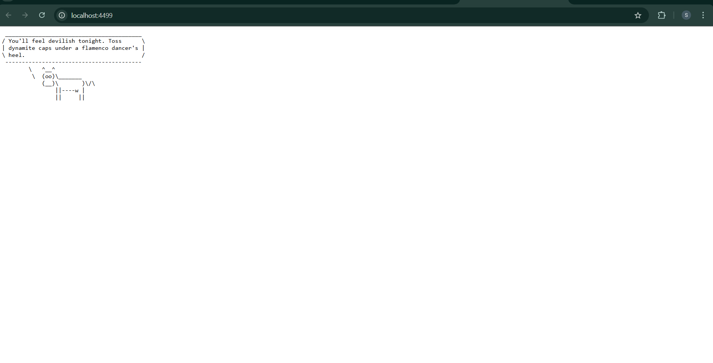

# Wisecow DevOps Project

This repository showcases my DevOps skills through multiple problem statements, including **containerization, Kubernetes deployment, CI/CD pipelines, monitoring/automation scripts, and zero-trust security policies**. 

## 📸 Screenshots
## 📸 Screenshots



I have divided the work into three problem statements for clarity.

---

## 🚀 Problem Statement 1: Containerisation and Deployment of Wisecow Application on Kubernetes

**Title:**  
Containerisation and Deployment of Wisecow Application on Kubernetes  

**Original App Repository:** [Wisecow Application](https://github.com/nyrahul/wisecow)  

**Objective:**  
To containerize and deploy the Wisecow application on a Kubernetes environment (Kind / Minikube / EKS) with secure **TLS communication** and an automated **CI/CD pipeline**.

### ✅ Requirements Fulfilled

- **Dockerization:**
  - Created a `Dockerfile` to containerize the Wisecow application.
  - Built and pushed the image to Docker Hub.

- **Kubernetes Deployment:**
  - Wrote Kubernetes manifests for Deployment, Service, and Ingress.
  - Exposed the Wisecow app via a Kubernetes Service.
  - Integrated TLS with Kubernetes Ingress for secure HTTPS communication.

- **CI/CD with GitHub Actions:**
  - Automated workflow for:
    - Building and pushing Docker image on every commit.
    - Deploying application automatically to the Kubernetes cluster (Continuous Deployment).
  
- **TLS Implementation (Challenge Goal):**
  - Configured Ingress with TLS certificates for secure communication.

### 📂 Expected Artifacts in this Repository
- Application source code.  
- `Dockerfile`.  
- Kubernetes manifests (`deployment.yaml`, `service.yaml`, `ingress.yaml`).  
- GitHub Actions workflow (`.github/workflows/ci-cd.yml`).  

**End Goal:**  
Successfully containerized and deployed the Wisecow application on Kubernetes, automated with CI/CD, and secured using TLS.

---
## 🛠️ Problem Statement 2: Automation Scripts

For this problem, I implemented **two tasks** using different approaches to showcase versatility:  

---

### ✅ Task 1: System Health Monitoring Script (Python)

**Objective:**  
Monitor the health of a Linux system by checking CPU, memory, disk space, and running processes. If thresholds are exceeded, log warnings to a file and display them on the console.  

**Implementation Details:**  
- Script: `system_health_monitor.py`  
- Language: Python  
- Libraries: `psutil`, `logging`  
- Thresholds configured:
  - CPU > 80%  
  - Memory > 80%  
  - Disk > 80%  

**Features:**  
- Logs all system stats to `system_health.log` with timestamps.  
- Alerts are generated if any metric exceeds thresholds.  
- Prints system usage in real-time for quick monitoring.  

**Sample Output:**  


## 🛠️ Problem Statement 2: Bash/Python Automation Tasks

For this problem, I selected **two objectives** and implemented them using scripting.

### 1. **System Health Monitoring Script**
- Monitors Linux system resources:
  - CPU usage  
  - Memory usage  
  - Disk space  
  - Running processes  
- Sends alerts to log file/console if thresholds are exceeded (e.g., CPU > 80%).  

**File:** `system_health_monitor.sh`  

---

---

### ✅ Task 2: Automated Backup Solution (Bash)

**Objective:**  
Automate the backup of a specified directory to a destination folder (local or remote server). Provide a report of success/failure.  

**Implementation Details:**  
- Script: `automated_backup.sh`  
- Language: Bash  
- Tools: `tar`, `date`, `cron` (for scheduling)  

**Features:**  
- Compresses the source directory into a `.tar.gz` archive.  
- Appends a **timestamp** to every backup for versioning.  
- Logs results to `backup.log` for tracking success/failure.  
- Can be extended to copy backups to remote/cloud storage.  

**Sample Usage:**  
```bash
./automated_backup.sh /path/to/source /path/to/backup


---

## 🔐 Problem Statement 3 (Optional): Zero-Trust Security with KubeArmor

**Objective:**  
Implement a **zero-trust KubeArmor policy** for the Kubernetes workload deployed in Problem Statement 1.

### ✅ Work Done
- Wrote a **KubeArmor security policy YAML** for Wisecow application pods.  
- Applied it to the Kubernetes cluster.  
- Captured screenshots showcasing policy violations.  

**Artifacts in this Repo:**
- `kubearmor-policy.yaml`  
- Screenshot of policy violation logs.  

---

## 📊 Skills Demonstrated

- **Containerization:** Docker  
- **Orchestration:** Kubernetes (Minikube, Kind, EKS)  
- **CI/CD:** GitHub Actions workflows  
- **Security:** TLS, KubeArmor Zero-Trust policies  
- **Automation:** Bash & Python scripting  
- **Monitoring & Backup Automation**  

---

## 🎯 End Result

This project highlights my ability to:
- Take an existing application and **make it production-ready**.  
- Build **automated pipelines** for deployment.  
- Ensure **security with TLS and zero-trust policies**.  
- Write **monitoring and backup scripts** to support operations.  

It demonstrates both **DevOps engineering** and **cloud-native practices**, making the solution **scalable, secure, and automated**.

---
